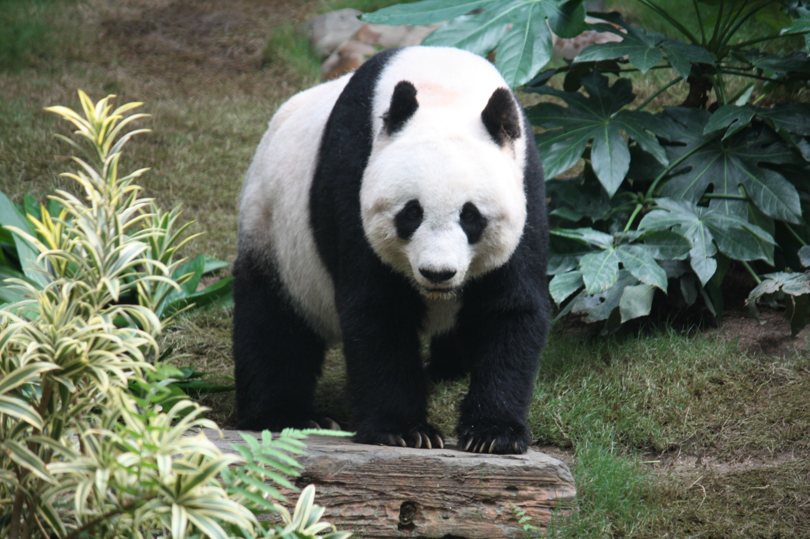

# Welcome to Tian's Project! 👋

## Table of Contents
* [CSE110](https://join.slack.com/t/cse110spring2026group/shared_invite/zt-3tpvwhm0h-cW23TPps0uGAQdjpL6jJcw)
* [About Me](#about-me)
* [Technical Skills](#technical-skills)

---

## About Me
I am a 4th year CS major student.

> "Programs must be written for people to read, and only incidentally for machines to execute." 
> — *Harold Abelson*

---

## Lovely animal

---

## Technical Skills

### Languages & Tools
* **Frontend:** HTML, CSS, JavaScript
* **Backend:** Python, Node.js
* **Tools:** 1.Git 
             2.VS Code

### My Favorite Code Snippet
To print a simple greeting in Python, I use:
`print("Hello, World!")`

## Todo List
- [x] Fill out Individual and Team Survey
- [ ] Lab Week 1

